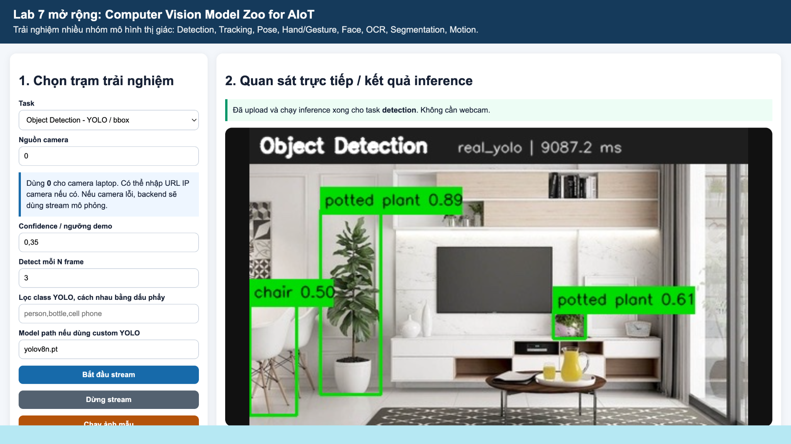

# Lab 7 mở rộng: Computer Vision Model Zoo for AIoT

> Học phần: Triển khai, phát triển ứng dụng AI và IoT  
> Chủ đề: Trải nghiệm nhiều nhóm mô hình thị giác máy tính cho AIoT: Detection, Tracking, Pose, Hand/Gesture, Face, OCR, Segmentation và Motion.

---

## 1. Giới thiệu

Project này là bài thực hành **Lab 7 mở rộng - Computer Vision Model Zoo for AIoT**.  
Mục tiêu của bài lab là giúp sinh viên không chỉ sử dụng YOLO cho Object Detection, mà còn trải nghiệm nhiều dạng output khác nhau trong Computer Vision để chọn hướng phù hợp cho bài tập lớn AIoT.

Các nhóm xử lý chính:

| Nhóm model | Output chính | Ý nghĩa trong AIoT |
|---|---|---|
| YOLO Detection | bbox, class, confidence | Biết vật gì xuất hiện và nằm ở đâu |
| Tracking / Counting | object_id, centroid, count | Theo dõi đối tượng theo thời gian, đếm qua vạch |
| Pose Landmark | body landmarks | Phân tích tư thế, hành vi, té ngã prototype |
| Hand / Gesture | hand landmarks, gesture label | Điều khiển IoT bằng cử chỉ |
| Face Landmark | face landmarks, attention cue | Nhận biết trạng thái khuôn mặt, chú ý, ngủ gật |
| OCR | text, text bbox, confidence | Đọc biển số, nhãn, phiếu kho, tài liệu |
| Segmentation | mask, mask area, region bbox | Tách vùng vật thể, đo diện tích vùng lỗi/vùng bệnh |
| OpenCV Motion | motion area, motion bbox | Cảnh báo chuyển động đơn giản, kích hoạt AI nặng khi cần |

---

## 2. Kết quả demo

Ảnh dưới đây là kết quả upload ảnh và chạy inference bằng **YOLO thật** (`real_yolo`) trên dashboard, không cần dùng webcam.

<p align="center">
  
</p>

Kết quả quan sát được:

- Task: `Object Detection - YOLO / bbox`
- Engine: `real_yolo`
- Output: bounding box, class name, confidence score
- Đối tượng phát hiện: `potted plant`, `chair`
- Inference time: khoảng `9087.2 ms`

---

## 3. Cấu trúc project

```text
lab7_cv_model_zoo_aiot/
├── app.py                         # FastAPI backend, camera stream, upload ảnh, log/event
├── vision_engines.py              # Các engine xử lý: detection, tracking, pose, hand, face, OCR, segmentation, motion
├── index.html                     # Dashboard chọn task và quan sát kết quả
├── run_model_zoo_demo.py          # Chạy thử pipeline không cần camera thật
├── requirements_core.txt          # Thư viện bắt buộc
├── requirements_optional.txt      # Thư viện mở rộng: ultralytics, mediapipe, OCR, SAM...
├── model_zoo_config.json          # Danh sách task và hướng dẫn thao tác
├── data/
│   ├── sample_images/             # Ảnh mẫu
│   └── captures/                  # Ảnh kết quả sau inference
├── outputs/
│   ├── detection_log.csv
│   ├── tracking_count_log.csv
│   ├── pose_log.csv
│   ├── gesture_log.csv
│   ├── face_log.csv
│   ├── ocr_log.csv
│   ├── segmentation_log.csv
│   ├── motion_log.csv
│   └── model_zoo_event_log.csv
└── docs/
    └── images/
        └── yolo_detection_result.png
```

---

## 4. Cài đặt trên MacBook

### Bước 1: Tạo môi trường ảo

```bash
python3 -m venv .venv
source .venv/bin/activate
```

### Bước 2: Cập nhật pip

```bash
python -m pip install --upgrade pip setuptools wheel
```

### Bước 3: Cài thư viện bắt buộc

```bash
pip install -r requirements_core.txt
```

Nếu gặp lỗi OpenCV do NumPy 2.x, chạy lại:

```bash
python -m pip uninstall -y numpy opencv-python opencv-contrib-python opencv-python-headless
python -m pip install "numpy==1.26.4"
python -m pip install --only-binary=:all: "opencv-python==4.9.0.80"
python -m pip install fastapi uvicorn python-multipart pillow
```

Kiểm tra OpenCV:

```bash
python -c "import numpy as np; import cv2; print('numpy:', np.__version__); print('opencv:', cv2.__version__)"
```

---

## 5. Chạy thử pipeline không cần camera

```bash
python run_model_zoo_demo.py
```

Nếu thành công, terminal sẽ hiển thị:

```text
LOCAL_PIPELINE_TEST_PASS
```

Sau khi chạy, kiểm tra các file sinh ra:

```bash
ls outputs
ls data/captures
```

Các file quan trọng:

- `outputs/model_zoo_demo_report.json`
- `outputs/model_zoo_event_log.csv`
- `data/captures/demo_detection.jpg`
- `data/captures/demo_ocr.jpg`
- `data/captures/demo_segmentation.jpg`
- các file log CSV tương ứng từng task

---

## 6. Chạy dashboard

```bash
uvicorn app:app --reload --host 127.0.0.1 --port 8000
```

Mở trình duyệt:

```text
http://127.0.0.1:8000/
```

---

## 7. Upload ảnh và chạy inference không cần webcam

Dashboard đã được chỉnh để hỗ trợ upload ảnh và hiển thị kết quả trực tiếp ở khung:

```text
2. Quan sát trực tiếp / kết quả inference
```

Cách sử dụng:

1. Chọn task ở cột bên trái.
2. Chọn ảnh từ máy.
3. Bấm **Upload và chạy model**.
4. Ảnh kết quả sau inference sẽ hiện ngay trên màn hình.
5. JSON output sẽ hiển thị ở phần kết quả để xem `engine`, `records`, `confidence`, `bbox`, `event_type`, `elapsed_ms`.

---

## 8. Cài model thật khi cần

Mặc định project có thể chạy bằng demo/fallback để đảm bảo pipeline hoạt động.  
Nếu muốn dùng model thật, cài thêm theo nhu cầu.

### YOLO thật

```bash
pip install ultralytics
```

Model path trên dashboard:

```text
yolov8n.pt
```

Nếu JSON output có:

```json
"engine": "real_yolo"
```

nghĩa là đang chạy YOLO thật.

### MediaPipe cho Pose / Hand / Face

```bash
pip install mediapipe
```

### OCR thật bằng EasyOCR

```bash
pip install easyocr
```

Không nên cài toàn bộ thư viện optional cùng lúc nếu máy yếu, vì một số thư viện khá nặng.

---

## 9. Các task đã trải nghiệm

| STT | Task | Mục tiêu quan sát | Output |
|---:|---|---|---|
| 1 | Object Detection / YOLO | Đưa ảnh có vật thể vào model | bbox, class, confidence |
| 2 | Tracking & Counting | Theo dõi vật/người qua vạch | object_id, centroid, count_in/count_out |
| 3 | Pose Landmark | Quan sát landmark cơ thể | body keypoints |
| 4 | Hand / Gesture | Nhận dạng bàn tay/cử chỉ | hand landmarks, gesture label |
| 5 | Face Landmark | Quan sát điểm landmark khuôn mặt | face landmarks, attention cue |
| 6 | OCR | Đọc chữ từ ảnh | text, text bbox, confidence |
| 7 | Segmentation | Tách vùng vật thể | mask, mask area, region bbox |
| 8 | OpenCV Motion | Phát hiện vùng chuyển động | motion area, motion bbox |

---

## 10. Tham số đã thử

Một số tham số có thể thay đổi khi làm bài:

| Tham số | Ý nghĩa | Nhận xét |
|---|---|---|
| `confidence` | Ngưỡng tin cậy của detection | Tăng confidence thì số bbox thường giảm, nhưng kết quả chắc chắn hơn |
| `detect_every` | Số frame mới chạy detection một lần | Tăng giá trị này giúp nhẹ máy hơn nhưng phản hồi chậm hơn |
| `class filter` | Lọc class YOLO cần quan sát | Chỉ giữ các class cần thiết như `person`, `bottle`, `cell phone` |
| `motion threshold` | Ngưỡng phát hiện chuyển động | Ngưỡng thấp dễ nhạy, ngưỡng cao giảm nhiễu nhưng có thể bỏ sót |
| `model_path` | Đường dẫn model YOLO | Ví dụ `yolov8n.pt` hoặc custom model `.pt` |

---

## 11. Yêu cầu nộp bài theo PDF

Các thành phần cần nộp:

- [ ] Ảnh chụp dashboard khi chạy ít nhất **4 task khác nhau**.
- [ ] File `outputs/model_zoo_demo_report.json`.
- [ ] Ít nhất **4 file log CSV** tương ứng với các task đã chạy.
- [ ] Bảng so sánh gồm: task, output, tham số đã thử, lỗi quan sát được, ý tưởng BTL liên quan.
- [ ] Trả lời câu hỏi trong file:

```text
docs/07_CAU_HOI_VA_YEU_CAU_THAY_DOI_THAM_SO.md
```

---

## 12. Bảng so sánh kết quả

| Task | Output quan sát | Tham số đã thử | Lỗi / hạn chế quan sát được | Ý tưởng BTL liên quan |
|---|---|---|---|---|
| YOLO Detection | bbox, class, confidence | confidence 0.35, model `yolov8n.pt` | Có thể nhận sai hoặc bỏ sót vật nhỏ, vật bị che khuất | Phát hiện người/vật trong phòng học |
| OCR | text, text bbox, confidence | ảnh rõ / ảnh mờ | Chữ nhỏ, nghiêng, mờ hoặc thiếu sáng dễ đọc sai | Đọc biển số xe, phiếu kho, nhãn sản phẩm |
| Segmentation | mask, mask area, region bbox | upload nhiều ảnh khác nhau | Mask có thể chưa khít vật thể | Đo diện tích bệnh lá cây, vùng lỗi sản phẩm |
| OpenCV Motion | motion area, motion bbox | motion threshold | Dễ nhiễu khi ánh sáng thay đổi | Cảnh báo chuyển động ban đêm |

---

## 13. Trả lời nhanh một số câu hỏi bản chất

### Tăng confidence thì số bbox thay đổi thế nào?

Khi tăng `confidence`, số lượng bbox thường giảm vì model chỉ giữ lại các dự đoán có độ tin cậy cao hơn. Tuy nhiên, vật nhỏ, xa camera hoặc bị che khuất có thể bị bỏ sót.

### Vì sao tracking cần nhiều frame?

Tracking cần nhiều frame để gán `object_id` và theo dõi quỹ đạo của đối tượng. Nếu chỉ dùng một frame, hệ thống chỉ biết vật đang ở đâu tại thời điểm đó, không biết vật đã đi qua vạch hay chưa.

### Khi nào cần segmentation thay vì bounding box?

Segmentation cần thiết khi muốn biết chính xác vùng vật thể, ví dụ đo diện tích bệnh trên lá cây hoặc vùng lỗi trên sản phẩm. Bounding box chỉ cho biết khung bao quanh vật thể, không đo chính xác hình dạng vùng.

### Motion detection có phải AI model không?

OpenCV Motion Detection không phải model AI học sâu. Nó thường dựa trên sự khác biệt giữa các frame. Tuy vậy, nó vẫn hữu ích trong AIoT vì có thể dùng làm cảnh báo nhanh hoặc kích hoạt model AI nặng khi phát hiện chuyển động.

### Có nên cho model điều khiển actuator trực tiếp không?

Không nên. Output của model cần được chuyển thành event, đi qua rule an toàn và có human review nếu rủi ro cao. Điều này giúp tránh việc model nhận sai nhưng vẫn điều khiển thiết bị thật.

---

## 14. Rubric đánh giá

| Tiêu chí | Mô tả | Điểm |
|---|---|---:|
| Chạy được dashboard | Mở được `index.html`, camera hoặc stream mô phỏng hoạt động | 1.0 |
| Trải nghiệm nhiều model | Chạy ít nhất 4 task khác nhau và có ảnh minh chứng | 2.0 |
| Hiểu output | Giải thích được bbox, landmarks, text, mask, tracking ID hoặc motion area | 2.0 |
| Thay đổi tham số | Có thử confidence, detect_every, class filter hoặc tham số tương đương | 1.5 |
| Log/event | Có log CSV và event log cho các task đã chạy | 1.0 |
| Phân tích lỗi | Nêu được khi nào model sai hoặc không ổn định | 1.0 |
| Liên hệ BTL | Chọn được công nghệ phù hợp cho một ý tưởng BTL | 1.0 |
| Tổng |  | 10 |

---

## 15. Ghi chú triển khai

- Project có fallback/demo mode để sinh viên vẫn chạy được khi chưa cài model thật.
- YOLO thật cần `ultralytics` và model path như `yolov8n.pt`.
- Pretrained model chỉ phù hợp để thử nhanh. Khi triển khai thực tế cần kiểm chứng, fine-tune hoặc train lại bằng dữ liệu phù hợp.
- Với các bài toán rủi ro cao như cảnh báo té ngã, an toàn lao động, đóng/mở thiết bị IoT, cần có rule an toàn và cơ chế kiểm tra lại.

---

## 16. Lệnh chạy nhanh

```bash
source .venv/bin/activate
uvicorn app:app --reload --host 127.0.0.1 --port 8000
```

Mở:

```text
http://127.0.0.1:8000/
```
